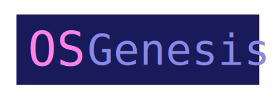

# Homepage

    

A shell-based tool to automate management of system packages on a Linux machine - the shell scripts in this repo act as a central configuration of packages to install and update. If your machine breaks down or you get a new one - no worries, your dev environment can be rebuilt using this repo.

This can bootstrap a fresh Linux installation to make it ready for development and then after that also be used maintain the packages and package configuration.

This project aims to make this fast, easily, reproducible and visible in version control (so there is a history of what package names and config values you used that can be read on GitHub).

This is for my own use, but others can use this project, a fork of it or just use this as reference on how to install/update packages.

## Intro

- [Sample usage](sample-usage.md)
- [About](about.md)

## Setup and run

These docs deal directly with using this project:

- [Installation](installation.md)
- [Usage](usage.md)

For packages like Go and Rust, there are flows which use the system package manager or not. I discuss those in a [blog post here](https://michaelcurrin.github.io/coding-blog/2020/08/25/package-manager-choice.html).

## Other notes

These docs are notes for myself on how to setup a machine from scratch.

- [Setup steps](other/setup-steps.md)
- [Tips](other/tips.md)
- [macOS](other/mac-os.md)
